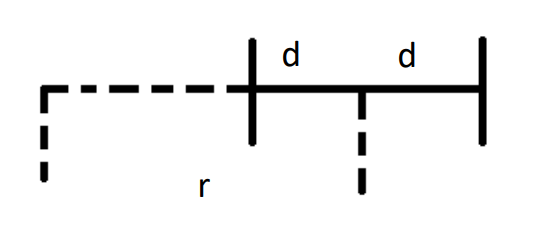

## 

常用的动力学模型有2、3、5、7等自由度，

### 运动模型的作用

在给定了某个时刻的控制输入$(a, \theta	)$以后，我们就可以估算车辆在下一时刻的状态信息(坐标，偏航角以及速度)。

## 差分轮模型

输入$(V_r,V_l)$,得到$(V_{car},\omega)$,差分底盘系统是一种欠驱动系统，仅能进行圆弧运动。

(1) 已知：

1. 底盘后轮左轮和右轮速度$v_l,v_r$

2. 轮子离底盘中心的距离：$d$

3. 两轮之间的距离： $b = 2d$

  (2) 求底盘中心的速度$v$和角速度$\omega$

当车体进行圆弧运动时，R为圆弧半径，d是一半的轮距, $\Phi$为电机的转速，$r_{wheel}$为轮子的半径。

已知，“电机的转速运动” 与 “差分轮的圆周运动” 有如下关系：

$$
v_l=(R-d)*\omega_l=\Phi_l*2\pi r_{wheel}  \\
v_r=(R+d)*\omega_r=\Phi_r*2\pi r_{wheel}
$$

**note：$v$为轮子做圆弧运动的线速度，$\omega$为圆弧运动的角速度，$\Phi$为电机的转速**

由上可得圆弧运动的角速度方程
$$
\omega_l=\frac{v_l}{(R-d)}\\
\omega_r=\frac{v_r}{(R+d)}
$$
由于左右两轮的角速度相等
$$
\frac{v_l}{R-d}=\frac{v_r}{R+d}
$$
所以运动圆弧半径R为
$$
R=\frac{(v_r+v_l)*d}{vr-vl}
$$
由于
$$
\omega_r=\omega_l=\frac{v_r}{R+d}\\
R+d=\frac{(v_r+v_l)*d}{vr-vl}+d=\frac{(v_r+v_l)*d}{vr-vl}+\frac{(v_r-vl)*d}{(v_r-v_d)}=\frac{2v_r*d}{v_r-v_l}
$$
所以 ,将角速度$\omega_{car}$和线速度$v_{car}$用$v_r,v_l$表示：

​		底盘中心角速度$\omega_{car}$
$$
\omega_{car}=\omega_r=\omega_l=\frac{v_r-v_l}{2d}
$$
​		底盘中心线速度$v_{car}$
$$
v_{car}=\omega_r*R=\omega_l*R \\
v_{car}=\frac{v_l+v_r}{2}
$$

综上

​	**运动模型正解(input:$v_l,v_r$或$\Phi_l,\Phi_r$;output:$v_{car} \omega_{car}$)：**
$$
v_{car}=\frac{v_l+v_r}{2}=\pi r_{wheel}(\Phi_l+\Phi_r)\\
\omega_{car}=\frac{v_r-v_l}{2d}=\frac{\pi r_{wheel}(\Phi_r-\Phi_l)}{d}\\
R=\frac{(v_r+v_l)*d}{vr-vl}=\frac{(\Phi_r+\Phi_l)*d}{\Phi_r-\Phi_l}
$$
​	**运动模型逆解(input: $v_{car} \omega_{car}$;output:$v_l,v_r$或$\Phi_l,\Phi_r$)：**
$$
R=\frac{v_{car}}{\omega_{car}}\\
v_l=(R-d)*\omega_{car}\\
v_r=(R+d)*\omega_{car}
$$
​	扩展可得
$$
2\pi r_{wheel}*\Phi_l=(\frac{v_{car}}{\omega_{car}}-d)*\omega_{car}\\
2\pi r_{wheel}*\Phi_r=(\frac{v_{car}}{\omega_{car}}+d)*\omega_{car}\\
$$
矩阵化
$$
\begin{bmatrix}
 \Phi_l\\
 \Phi_r
\end{bmatrix}
=
\begin{bmatrix}
\frac{1}{2\pi r_{wheel}} & \frac{-d}{2\pi r_{wheel}}\\
\frac{1}{2\pi r_{wheel}} & \frac{d}{2\pi r_{wheel}}
\end{bmatrix}
\begin{bmatrix}
v_{car} \\
\omega_{car}
\end{bmatrix}
$$
